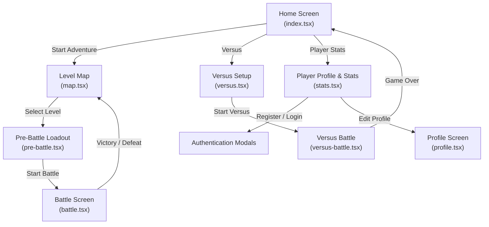
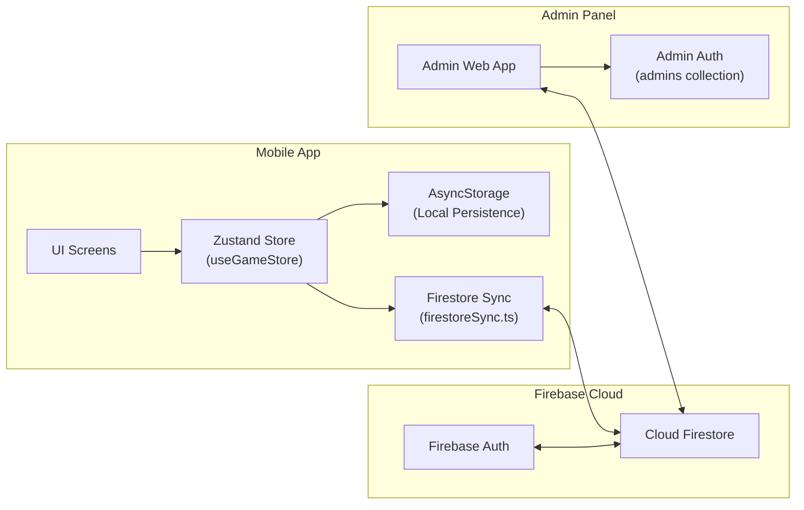
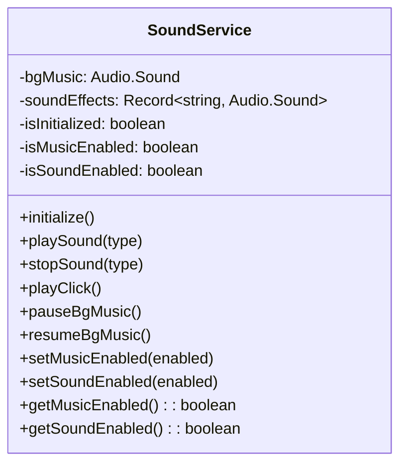

# Algebrawls — System Documentation

> **Prepared for:** Academic Project Defense  
> **Application Name:** Algebrawls  
> **Version:** 1.0.0  
> **Platform:** Android / iOS (React Native — Expo)  
> **Date:** May 2026

---

## Table of Contents

1. [System Overview](#1-system-overview)
2. [Technologies Used](#2-technologies-used)
3. [System Architecture](#3-system-architecture)
4. [Key Features — User Side](#4-key-features--user-side)
5. [Key Features — Admin Side](#5-key-features--admin-side)
6. [Audio System](#6-audio-system)
7. [Build & Deployment](#7-build--deployment)
8. [How the System Works — Gameplay Walkthrough](#8-how-the-system-works--gameplay-walkthrough)
9. [Tools & Dependencies](#9-tools--dependencies)

---

## 1. System Overview

**Algebrawls** is a mobile educational game application designed to make learning algebra engaging and interactive. The app gamifies fundamental algebra topics — from basic variables and expressions through systems of equations and exponents — by framing each topic as a turn-based battle between a player character (the "hero") and an enemy character (the "villain").

### Purpose

The primary objective of Algebrawls is to help students practice and reinforce algebra skills through a game-based learning approach. By answering algebra questions correctly within a time limit, players deal damage to an enemy; incorrect answers or timeouts cost the player hearts (health points). This mechanic encourages both accuracy and speed.

### Target Users

- **Primary:** High school and junior high school students studying algebra
- **Secondary:** Educators looking for supplemental, gamified review tools
- **Tertiary:** Casual learners who enjoy math-based puzzle games

### System Components

| Component | Description |
|-----------|-------------|
| **User-Side Mobile App** | React Native (Expo) application distributed as an Android APK (or iOS build). Contains all gameplay screens, battle logic, sound effects, and user authentication. |
| **Admin-Side Web Panel** | A separate React (Vite) web application for administrators to manage player accounts, monitor game progress, moderate user reviews, and maintain system health. |
| **Cloud Backend** | Google Firebase provides the backend infrastructure — Firestore for the database, Firebase Authentication for secure login, and Firebase Hosting for the admin panel. |

---

## 2. Technologies Used

### 2.1 User-Side Mobile Application

| Technology | Version | Purpose |
|-----------|---------|---------|
| **React Native** | 0.83.6 | Core cross-platform mobile framework for building native Android and iOS applications using JavaScript and React. |
| **Expo** | ~55.0.17 | A managed development platform built on top of React Native that simplifies building, testing, and deploying mobile apps. Provides access to native APIs without manual native configuration. |
| **TypeScript** | ~5.9.2 | A strongly typed superset of JavaScript that adds static type checking, improving code reliability and developer experience. |
| **Expo Router** | ~55.0.13 | File-based routing library for React Native apps. Each file in the `app/` directory automatically becomes a navigable screen. |
| **Zustand** | ^5.0.12 | A lightweight, fast state management library for React. Used as the central game store (`useGameStore`) to manage all player progress, authentication state, and statistics. |
| **AsyncStorage** | 1.23.1 | Persistent key-value storage on the device. Stores game progress, user preferences (audio settings), and authentication tokens locally so users can play offline. |
| **Firebase (JS SDK)** | ^12.13.0 | Client-side SDK for Firestore (database), Firebase Authentication (email/password login), and offline data caching. |
| **Expo AV** | ^16.0.8 | Audio and video playback library. Powers the entire sound system — background music, sound effects (click, hit, break, heartbreak, victory, defeat). |
| **React Native Reanimated** | 4.2.1 | High-performance animation library. Provides smooth, native-driven animations for UI transitions, sprite movements, and interactive feedback. |
| **React Native Gesture Handler** | ~2.30.0 | Handles touch gestures and interactions in a platform-native way, providing responsive button presses and swipe interactions. |
| **Expo Image** | ~55.0.9 | Optimized image loading component with caching support for displaying sprites, logos, and UI assets. |
| **Expo Splash Screen** | ~55.0.19 | Controls the app's splash/loading screen, preventing the UI from appearing until all assets and data have loaded. |
| **Expo Crypto** | ~55.0.14 | Provides cryptographic utilities. Used to generate UUIDs for guest user identification. |
| **Expo Auth Session** | ~55.0.15 | Manages authentication sessions within the Expo environment. |
| **Expo Updates** | ~55.0.22 | Enables over-the-air (OTA) updates so the app can receive code updates without requiring a full app store release. |
| **Expo Dev Client** | ~55.0.28 | Custom development client for testing native modules during development. |
| **cross-env** | ^10.1.0 | Utility for setting environment variables across different operating systems. Used to switch between development and production build variants. |

### 2.2 Admin-Side Web Application

| Technology | Version | Purpose |
|-----------|---------|---------|
| **React** | ^19.1.0 | Frontend UI framework for building the admin dashboard as a single-page application. |
| **Vite** | ^6.3.5 | Fast build tool and development server. Provides hot module replacement (HMR) for rapid admin panel development. |
| **Firebase (JS SDK)** | ^11.6.1 | Client-side Firebase SDK for connecting to the shared Firestore database and reading/writing player and review data. |
| **TailwindCSS** | ^4.3.0 | Utility-first CSS framework used for rapid, consistent styling of the admin dashboard UI. |
| **crypto-js** | ^4.2.0 | JavaScript library for cryptographic operations. Used to hash admin passwords with SHA-256 for secure credential verification. |

### 2.3 Backend & Infrastructure

| Service | Purpose |
|---------|---------|
| **Cloud Firestore** | NoSQL document database. Stores two main collections: `users` (player data, progress, stats) and `reviews` (post-game feedback). A separate `admins` collection stores admin credentials. |
| **Supabase / Auth** | Handles user registration and login via email/password using the user's provided email address. |
| **EAS Build (Expo Application Services)** | Cloud-based build service for compiling native Android APKs and iOS binaries without requiring local native toolchains. |
| **Expo Updates** | OTA update delivery service for pushing JavaScript bundle updates to deployed apps. |
| **Firebase Hosting** | Hosts the admin web panel as a static site. |

---

## 3. System Architecture

### 3.1 Project Directory Structure

```
algebrawls/
├── app/                        # Screens (file-based routing via Expo Router)
│   ├── _layout.tsx             # Root layout — initializes app, loads data & sound
│   ├── index.tsx               # Home screen — main menu
│   ├── map.tsx                 # Level selection map
│   ├── pre-battle.tsx          # Pre-battle loadout (gear, skill, armor selection)
│   ├── battle.tsx              # Main battle gameplay screen
│   ├── versus.tsx              # Versus mode setup (2-player local)
│   ├── versus-battle.tsx       # Versus mode battle screen
│   ├── stats.tsx               # Player profile, stats, auth, achievements
│   ├── profile.tsx             # Profile management (username, in-game name)
│   └── login.tsx               # Login screen
├── components/                 # Reusable UI components
│   ├── NeoButton.tsx           # Neo-brutalist styled button with shadow
│   ├── SettingsButton.tsx      # Floating audio settings toggle (home screen)
│   ├── sprite.tsx              # Animated character sprite display
│   ├── ReviewModal.tsx         # Post-game review submission modal
│   ├── DeactivatedModal.tsx    # Account deactivation warning modal
│   ├── ErrorModal.tsx          # Generic error display modal
│   └── TouchableOpacity.tsx    # Custom touch wrapper with click sound
├── hooks/
│   └── useGameStore.ts         # Zustand store — central state management
├── services/
│   ├── firebase.ts             # Firebase app initialization & Firestore config
│   ├── firestoreSync.ts        # Firestore CRUD operations & data sync
│   ├── soundService.ts         # Audio system (SoundService singleton)
│   └── reviewService.ts        # Review submission to Firestore
├── scripts/
│   └── mathGenerator.ts        # Procedural algebra question generator
├── constants/
│   └── theme.ts                # Color and font constants
├── assets/
│   ├── audios/                 # Sound effect & music files (MP3)
│   └── images/
│       ├── logos/              # App logo images
│       └── sprites/            # Hero & villain sprite images
├── admin-web/                  # Admin panel (separate Vite + React app)
│   ├── src/
│   │   ├── App.jsx             # Admin app shell with routing
│   │   ├── main.jsx            # Entry point
│   │   ├── firebase.js         # Admin Firebase config
│   │   ├── pages/
│   │   │   ├── Login.jsx       # Admin login page
│   │   │   ├── Players.jsx     # Player management dashboard
│   │   │   └── Reviews.jsx     # Review moderation dashboard
│   │   ├── components/
│   │   │   └── Sidebar.jsx     # Navigation sidebar
│   │   ├── context/
│   │   │   └── AdminAuthContext.jsx  # Admin auth context provider
│   │   └── services/
│   │       └── adminAuth.js    # Admin authentication logic (SHA-256)
│   └── package.json
├── app.config.ts               # Expo app configuration (dynamic per variant)
├── eas.json                    # EAS Build profile configuration
├── firebase.json               # Firebase project configuration
├── firestore.rules             # Firestore security rules
└── package.json                # Project dependencies
```

### 3.2 Screen Navigation Flow



### 3.3 Data Flow Architecture



**Key Data Flow Principles:**

1. **Local-First:** Game state is always persisted to AsyncStorage first, ensuring offline playability.
2. **Cloud Sync:** When online, the Zustand store fires-and-forgets a sync to Firestore, keeping the cloud copy updated.
3. **Merge Strategy:** On app load, both local and cloud data are fetched, and the "best" values are merged (using `Math.max()` for numerical stats, best score per level).
4. **Admin Independence:** The admin panel reads directly from Firestore using real-time listeners (`onSnapshot`), completely independent of the mobile app's state.

### 3.4 State Management (Zustand Store)

The central `useGameStore` manages all application state:

| State Property | Type | Description |
|---|---|---|
| `userId` | `string \| null` | Unique identifier — UUID for guests, Firebase Auth UID for registered users |
| `username` | `string \| null` | Permanent login username |
| `ingameName` | `string \| null` | Editable display name visible to other players |
| `isLoggedIn` | `boolean` | Whether the user has registered/logged in |
| `isLoaded` | `boolean` | Whether initial data loading has completed |
| `unlockedLevel` | `number` | Highest level the player has access to (1–7) |
| `totalXP` | `number` | Cumulative experience points earned |
| `totalBattlesWon` | `number` | Total number of battles won |
| `totalBattles` | `number` | Total number of battles played |
| `currentStreak` | `number` | Current consecutive win streak |
| `maxStreak` | `number` | Highest streak ever achieved |
| `levelStars` | `Record<number, number>` | Best score (correct answers) per level |

---

## 4. Key Features — User Side

### 4.1 Adventure Mode (Campaign)

The core single-player experience consists of **7 progressively difficult levels**, each focused on a specific algebra topic:

| Level | Topic | Questions | Time/Q | Description |
|-------|-------|-----------|--------|-------------|
| 1 | Variables & Expressions | 10 | 30s | Evaluate algebraic expressions by substituting values and combining like terms. |
| 2 | Equations & Inequalities | 20 | 30s | Isolate variables to solve equations and determine inequality ranges. |
| 3 | Polynomials | 20 | 60s | Add, subtract, and multiply multi-term polynomial expressions (FOIL method). |
| 4 | Factoring | 30 | 60s | Factor expressions using GCF extraction, trinomial factoring, and pattern recognition. |
| 5 | Systems of Equations | 30 | 60s | Solve for two unknowns using substitution, elimination, and system analysis. |
| 6 | Exponents & Roots | 50 | 60s | Simplify expressions with exponent laws, perfect squares, and radical operations. |
| 7 | Random Mode | 100 | 22–27s (dynamic) | Endurance mode combining questions from all 6 previous topics with adaptive difficulty. |

**Progressive Difficulty Within Levels:** Each level implements internal difficulty scaling. The `mathGenerator.ts` script uses a `progress` ratio (0.0 = first question, 1.0 = last question) to gradually increase number ranges, introduce harder operations (+/− → ×/÷), and select more complex question templates as the player advances through the level.

### 4.2 Battle System

The battle screen presents a turn-based combat interface:

- **Player Character (Hero):** Displayed on the left with animated sprites (idle, attack, hit, win, defeat).
- **Enemy Character (Villain):** Displayed on the right with its own set of animated sprites.
- **Heart/Life System:** The player starts with **3 hearts** (can be increased to 4 or 5 with gear bonuses). Each wrong answer or timeout costs 1 heart. Losing all hearts results in defeat.
- **Timer:** A per-question countdown timer creates urgency. When the timer reaches ≤5 seconds, it turns red to signal danger.
- **Answer Selection:** Questions display 4 options (Levels 1–3) or 6 options (Levels 4–7) as tappable buttons. Correct answers flash green; incorrect answers flash red while the correct answer is highlighted.
- **Victory Condition:** Defeating all enemy HP (equal to the question count) wins the level.
- **Defeat Condition:** Losing all hearts ends the battle.

### 4.3 Equipment System (Gear, Armor, Skills)

Before each battle, the player visits a **Pre-Battle Loadout** screen to select one item from each of three categories:

#### Gears (Passive Bonuses)

| Gear | Bonus | Unlock Level |
|------|-------|-------------|
| ✏️ No. 2 Pencil | +2 seconds per question | 1 |
| 📓 Study Notes | +1 starting heart | 1 |
| 📏 Math Ruler | +4 seconds per question | 3 |
| 📱 Pocket Calc | +2 starting hearts | 5 |
| 📐 Golden Protractor | 2× XP multiplier | 7 |

#### Skills (Active Abilities — Single Use)

| Skill | Effect | Unlock Level |
|-------|--------|-------------|
| ⚔️ Basic Attack | Standard damage (default) | 1 |
| ⏱️ Focus | Add 5 seconds to the current timer | 2 |
| 🛡️ Shield | Block 1 wrong answer without losing a heart | 4 |
| 🔥 Double Strike | Next correct answer deals 2× damage | 6 |

#### Armors (Cosmetic — Unlock-Based Progression)

| Armor | Unlock Level |
|-------|-------------|
| 🦺 Leather Jerkin | 1 |
| ⛓️ Iron Chainmail | 2 |
| 🛡️ Steel Cuirass | 3 |
| 🪖 Knight Helmet | 4 |
| 🐲 Dragon Scale Mail | 5 |
| 🌟 Mythril Plate | 6 |

### 4.4 Versus Mode (Local 2-Player)

Versus mode enables two players to compete on the **same device** in a turn-based format:

- Each player enters their name and selects a gear and skill.
- The battle consists of **20 questions**.
- Players take turns answering questions from a randomized pool.
- The player with the higher score at the end wins.

### 4.5 Player Stats & Achievements

The **Player Stats** screen provides a comprehensive view of the player's progress:

- **Player Card:** Displays the player's in-game name, level, rank (Novice or Mathlete), and XP progress bar.
- **Battle Statistics Grid:** Total battles, battles won, win rate (%), and max streak.
- **Level Progress:** Per-level score progress bars showing `score/totalQuestions` with distinct coloring for perfect scores.
- **Equipment/Skills Inventory:** Visual grid of all unlocked gears, skills, and armors.
- **Achievements System:** Six trackable achievements:
  - 🎯 First Blood — Win your first battle
  - 🔥 On Fire — Achieve a 5-win streak
  - 👑 Undefeated — Win 5 battles total
  - 💀 Boss Slayer — Defeat the Math Overlord (Level 7)
  - ⚡ Speed Demon — Answer in under 5 seconds
  - 💎 Perfectionist — Perfect score on all levels

### 4.6 User Authentication System

Algebrawls supports **two user modes**:

1. **Guest Mode (Default):** Users play immediately without registration. A unique UUID is generated and stored locally. All progress is saved to AsyncStorage and synced to Firestore.
2. **Registered Mode:** Users can register with a username and password. This enables:
   - Cross-device progress restoration
   - Unique in-game name selection (with random name suggestions)
   - Review submission capability
   - Account persistence beyond device changes

**Registration Flow:**
1. User enters a username (minimum 3 characters) and password (minimum 6 characters)
2. System checks for username uniqueness via Firestore query
3. User selects an in-game display name (with "Suggest" button for random names)
4. Supabase Authentication creates the account using the user's provided email address and password
5. Current guest progress is migrated to the new authenticated user ID
6. Local storage is updated with the authenticated session

**Login Flow:**
1. User enters username and password
2. Firebase Authentication validates credentials
3. Cloud data is fetched from Firestore
4. Local state is replaced with the authenticated user's cloud data
5. System checks if the account has been deactivated by an admin

### 4.7 Post-Game Review System

After completing a battle (win or lose), a **ReviewModal** appears allowing logged-in users to:

- Rate their experience from 1 to 5 stars
- Optionally write a comment (up to 200 characters)
- Submit the review to the Firestore `reviews` collection

Guest users are shown a "Login Required" prompt if they attempt to submit a review.

### 4.8 Account Deactivation Handling

When a logged-in user's account has been deactivated by an admin:

- On app launch, the `_layout.tsx` root layout checks the account status via `checkAccountStatus()`
- If the account is inactive, a `DeactivatedModal` is displayed
- The user is forced to log out and starts a fresh guest session
- Deactivated accounts are also blocked at the login screen with an appropriate error message

---

## 5. Key Features — Admin Side

The admin panel is a separate web application accessible to authorized administrators.

### 5.1 Admin Authentication

Admin authentication is **completely independent** from player authentication:

- Admin credentials are stored in a dedicated `admins` Firestore collection
- Passwords are hashed using **SHA-256** (via `crypto-js`)
- Sessions are managed via `sessionStorage` (browser session tokens)
- No Firebase Authentication tokens are used — this prevents admin actions from interfering with player auth state

### 5.2 Player Management Dashboard

The **Players** page provides a comprehensive management interface:

| Feature | Description |
|---------|-------------|
| **Player Table** | Lists all registered players (those with a username) with display name, email, and status. |
| **Search** | Real-time search/filter by player name or ID. |
| **Status Overview** | Summary cards showing total players, active count, and inactive count. |
| **View Progress** | Expandable row for each player showing: level reached, total XP, total battles, battles won, current/max streak, level-by-level star progress, and unlocked loadout (armor, gears, skills). |
| **Activate / Deactivate** | Toggle a player's `isActive` flag. Deactivated players are blocked from logging in and are forced out of any active session. |
| **Delete Account** | Permanently delete a player's Firestore document with confirmation dialog. |
| **Purge Guest Data** | Bulk-delete orphaned guest documents (anonymous sessions with no registered username) to maintain database health. |

**Real-Time Updates:** The player table uses Firestore's `onSnapshot` for live data — any changes made (including those from other admins) are reflected instantly.

### 5.3 Review Moderation Dashboard

The **Reviews** page allows administrators to monitor and moderate user feedback:

| Feature | Description |
|---------|-------------|
| **Statistics Cards** | Displays average rating (out of 5) and total review count. |
| **Review Table** | Lists all reviews with player name, star rating (visual ★ display), comment text, and submission date. |
| **Delete Review** | Remove inappropriate or spam reviews with confirmation dialog. |
| **Real-Time Feed** | Uses Firestore `onSnapshot` with `orderBy('createdAt', 'desc')` for live updates sorted by newest first. |

### 5.4 Admin UI Design

The admin panel features:

- **Collapsible Sidebar** with navigation between Players and Reviews
- **Top Navigation Bar** showing the logged-in admin's email and a logout button
- **Confirmation Dialogs** for all destructive actions (delete, deactivate, purge)
- **Responsive Layout** that adapts to different screen sizes
- **Consistent Design Language** using a custom Tailwind theme with game-inspired colors

---

## 6. Audio System

### 6.1 Architecture

The audio system is implemented as a **singleton service** (`SoundService` class in `services/soundService.ts`) that manages all audio playback throughout the application.



### 6.2 Sound Assets

| Sound File | Key | Usage |
|-----------|-----|-------|
| `lobby.mp3` | Background Music | Looping ambient music that plays on app launch and throughout navigation. |
| `click.mp3` | `click` | Plays on every button tap via the custom `TouchableOpacity` wrapper. |
| `hit.mp3` | `hit` | Plays when the player answers correctly (hero attacks). |
| `break.mp3` | `break` | Plays when the player answers incorrectly or the timer runs out. |
| `heartbreak.mp3` | `heartbreak` | Plays when the player loses a heart. |
| `victory.mp3` | `victory` | Fanfare that plays on battle victory or when new items are unlocked. |
| `defeat.mp3` | `defeat` | Sound that plays on battle defeat. |

### 6.3 Initialization & Preloading

1. The `SoundService` is initialized once at app startup from the root `_layout.tsx` via `soundService.initialize()`.
2. Audio preferences (music on/off, sound effects on/off) are loaded from AsyncStorage.
3. The audio mode is configured for silent-mode playback on iOS (`playsInSilentModeIOS: true`).
4. Background music is created and set to loop with initial volume of 1.0.
5. All sound effects are preloaded into memory (`Audio.Sound.createAsync`) for low-latency playback.

### 6.4 Playback Behavior

- **One-Shot Effects:** Sound effects are replayed by seeking to position 0 before each `playAsync()`, allowing rapid re-triggers.
- **Victory/Defeat Ducking:** When a victory or defeat sound plays, the background music volume is reduced to 0.15. When the fanfare finishes (detected via `setOnPlaybackStatusUpdate`), the music volume is restored to 1.0.
- **Fallback Playback:** If a sound effect hasn't been preloaded (e.g., initialization failed), the service creates and plays it directly as a fallback.

### 6.5 Persistence of Preferences

Audio preferences are persisted using two AsyncStorage keys:

| Key | Value |
|-----|-------|
| `@algebrawl_musicEnabled` | `true` or `false` (JSON boolean) |
| `@algebrawl_soundEnabled` | `true` or `false` (JSON boolean) |

These preferences are loaded on initialization and applied immediately. Users can toggle audio settings from:

1. **Home Screen:** A floating `SettingsButton` (gear icon) in the top-right corner opens a dropdown with Music and Sound toggle switches.
2. **Pause Menu (In-Battle):** Music and sound effect toggles are available in the pause overlay during gameplay.

---

## 7. Build & Deployment

### 7.1 EAS Build Configuration

The project uses **EAS Build (Expo Application Services)** for compiling native binaries in the cloud. The build configuration is defined in `eas.json`:

| Build Profile | Purpose | Distribution | Build Type | Environment Variable |
|--------------|---------|-------------|------------|---------------------|
| `development` | Dev builds with hot-reload support via Expo Dev Client | Internal (team only) | Development client | `APP_VARIANT=development` |
| `preview` | Internal testing builds (APK for Android) | Internal | APK | `APP_VARIANT=preview` |
| `production` | Store-ready release builds | Public (app stores) | AAB (default) | `APP_VARIANT=production` |
| `production-apk` | Production builds as APK for direct distribution | Internal | APK | `APP_VARIANT=production` |

### 7.2 App Variant System

The app uses **dynamic configuration** (`app.config.ts`) to differentiate between build variants:

| Variant | App Name | Package Identifier |
|---------|----------|--------------------|
| Development | `algebrawls (Dev)` | `com.reiz_buh.algebrawls.dev` |
| Preview | `algebrawls (Preview)` | `com.reiz_buh.algebrawls.preview` |
| Production | `algebrawls` | `com.reiz_buh.algebrawls` |

This separation allows developers to install multiple build variants simultaneously on the same device without conflicts.

### 7.3 Build Commands

```bash
# Development build (requires Expo Dev Client)
eas build --profile development --platform android

# Preview build (APK for internal testing)
eas build --profile preview --platform android

# Production build (AAB for Play Store)
eas build --profile production --platform android

# Production APK (for direct distribution)
eas build --profile production-apk --platform android
```

### 7.4 Over-the-Air Updates

The app is configured for OTA updates via Expo Updates:

- **Update URL:** `https://u.expo.dev/f7ea3bec-3838-41a9-ae10-1f5a6ea7c266`
- **Check Strategy:** `ON_LOAD` — the app checks for updates every time it launches.
- **Runtime Version Policy:** `appVersion` — updates are scoped to the current app version.
- **Fallback Timeout:** 0ms — the app does not block startup waiting for an update.

### 7.5 Development Server

```bash
# Start development server (development variant)
npm run start
# Equivalent to: cross-env APP_VARIANT=development expo start

# Start production variant locally
npm run start:prod
# Equivalent to: expo start
```

### 7.6 Admin Panel Deployment

The admin web panel is built with Vite and can be deployed via Firebase Hosting:

```bash
cd admin-web

# Local development
npm run dev

# Production build
npm run build

# Deploy to Firebase Hosting (from project root)
firebase deploy --only hosting
```

---

## 8. How the System Works — Gameplay Walkthrough

The following describes the complete user journey from app launch to completing a level.

### Step 1: App Launch & Initialization

1. The app opens and displays the **splash screen** (controlled by `expo-splash-screen`).
2. The root layout (`_layout.tsx`) triggers two parallel initializations:
   - `loadLocalData()` — Reads user ID, username, and game state from AsyncStorage; fetches cloud data from Firestore; merges local and cloud data using a "best value" strategy.
   - `soundService.initialize()` — Loads audio preferences, configures audio mode, preloads all sound effects, and starts background music (if enabled).
3. If the user is logged in, the system verifies their account status (`checkAccountStatus()`). If the account has been deactivated by an admin, a `DeactivatedModal` forces logout.

### Step 2: Home Screen

4. The **Home Screen** (`index.tsx`) displays the Algebrawls logo with a bouncing animation and three main buttons:
   - **Start Adventure** → navigates to the Level Map
   - **Versus** → navigates to Versus Mode setup
   - **Player Stats** → navigates to the Player Profile
5. A floating **Settings Button** (⚙️) in the top-right corner provides quick access to audio toggles.

### Step 3: Level Map Selection

6. The **Map Screen** (`map.tsx`) presents all 7 levels as staggered cards arranged vertically.
7. Each level card shows:
   - Level number badge (blue circle for unlocked, gray for locked)
   - Topic title
   - Progress bar and score (`correct/total` or 🔒 for locked levels)
   - A "?" help button that opens an instruction modal with the level overview and core strategies
8. **Locked levels** appear faded and are non-interactive. Levels unlock sequentially upon winning the previous level.
9. The player taps an unlocked level to proceed.

### Step 4: Pre-Battle Loadout

10. The **Pre-Battle Screen** (`pre-battle.tsx`) displays:
    - Battle info card: number of questions, time limit per question, starting HP (3 hearts)
    - **Gear selection:** Horizontally scrollable row of gear items. Locked gears show a lock icon and the required unlock level.
    - **Armor selection:** Horizontally scrollable row of armor items with the same lock/unlock mechanic.
    - **Skill selection:** Vertical list with radio buttons. Each skill shows its name, description, and unlock status.
11. The player equips one gear, one armor, and one skill, then taps **"Start Battle!"**

### Step 5: Battle Phase

12. The **Battle Screen** (`battle.tsx`) initializes
    - Player HP is set to 3 + gear bonus hearts
    - Enemy HP is set to the total question count
    - The `mathGenerator.ts` generates the first question based on the level
    - The timer starts counting down
13. **Each turn:**
    - A math question is displayed with 4 or 6 multiple-choice options
    - The player can optionally activate their skill (one-time use)
    - The player selects an answer before the timer expires
14. **If correct:** The `hit` sound plays, the hero sprite shows an attack animation, the villain shows a hit animation, enemy HP decreases by 1 (or 2 with Double Strike), and a new question loads.
15. **If incorrect:** The `break` sound plays, the hero shows a hit animation, the villain attacks. If the Shield skill is active, it blocks the hit. Otherwise, the player loses 1 heart and the `heartbreak` sound plays.
16. **If timer expires:** Treated as an incorrect answer.
17. **Pause:** The player can pause at any time, revealing options to resume, quit, or toggle audio settings.

### Step 6: Battle Resolution

18. **Victory (Enemy HP reaches 0):**
    - The `victory` sound plays, sprites show win/defeat poses
    - A victory modal displays the score (`correct/total`)
    - `recordLevelProgress()` updates the player's best score for this level and unlocks the next level
    - `updateStats()` adds 50 XP (with possible 2× multiplier) and increments win counters
    - If new gear, skills, or armor are unlocked, a **"New Unlocks!"** modal is shown
    - State is persisted to both AsyncStorage and Firestore
19. **Defeat (Player HP reaches 0):**
    - The `defeat` sound plays, sprites show defeat/win poses
    - A defeat modal displays the score
    - `recordLevelProgress()` records the attempt (score is saved if it's a new best)
    - `updateStats()` resets the current streak and increments total battles
20. After dismissing the result modal, the **ReviewModal** appears (once per session), allowing the user to rate and comment on their experience.

### Step 7: Return to Map

21. The player is redirected back to the **Level Map**, which now reflects:
    - Updated progress bars and scores
    - Any newly unlocked levels (next level becomes accessible after a victory)
22. The player can replay levels for higher scores or proceed to the next challenge.

---

## 9. Tools & Dependencies

### 9.1 User-Side Dependencies (`package.json`)

| Package | Version | Description |
|---------|---------|-------------|
| `@react-native-async-storage/async-storage` | 1.23.1 | Persistent, asynchronous, unencrypted key-value storage for React Native. Stores game state, user preferences, and auth tokens locally on the device. |
| `@react-navigation/bottom-tabs` | ^7.15.5 | Bottom tab navigator component for React Navigation (available but not currently used in the main navigation). |
| `@react-navigation/elements` | ^2.9.10 | Shared UI elements for React Navigation (headers, backgrounds, etc.). |
| `@react-navigation/native` | ^7.1.33 | Core navigation library providing the navigation container and context for screen transitions. |
| `expo` | ~55.0.17 | The Expo SDK — provides managed workflow, native API access, and build tooling for React Native apps. |
| `expo-auth-session` | ~55.0.15 | Manages OAuth and authentication session flows within the Expo ecosystem. |
| `expo-av` | ^16.0.8 | Audio and video playback API. Used for background music, sound effects, and all game audio. |
| `expo-constants` | ~55.0.14 | Provides system-level constants such as app version, device information, and Expo configuration values. |
| `expo-crypto` | ~55.0.14 | Cryptographic utilities including `randomUUID()` for generating unique guest user identifiers. |
| `expo-dev-client` | ~55.0.28 | Custom development client that enables testing native modules during development without creating a production build. |
| `expo-device` | ~55.0.15 | Provides device-specific information such as manufacturer, model, and OS version. |
| `expo-font` | ~55.0.6 | Loads and manages custom fonts within the application. |
| `expo-glass-effect` | ~55.0.10 | Provides glass/blur effects for UI elements (available for visual styling). |
| `expo-image` | ~55.0.9 | High-performance image component with built-in caching, placeholder support, and efficient memory usage. |
| `expo-linking` | ~55.0.14 | Handles deep linking and URL-based navigation into the app. |
| `expo-router` | ~55.0.13 | File-system-based routing for React Native, inspired by Next.js. Each file in `app/` becomes a route. |
| `expo-splash-screen` | ~55.0.19 | Controls the native splash screen visibility during app initialization. |
| `expo-status-bar` | ~55.0.5 | Controls the device status bar appearance (color, visibility, style). |
| `expo-symbols` | ~55.0.7 | Access to SF Symbols (iOS) for native icon display. |
| `expo-system-ui` | ~55.0.16 | Controls system-level UI properties such as the root view background color. |
| `expo-updates` | ~55.0.22 | Enables over-the-air (OTA) JavaScript bundle updates without requiring a full app store submission. |
| `expo-web-browser` | ~55.0.14 | Opens external URLs in an in-app browser (used for OAuth flows and external links). |
| `firebase` | ^12.13.0 | The Firebase JavaScript SDK providing Firestore (database), Authentication, and offline persistence. |
| `react` | 19.2.0 | The core React library for building component-based user interfaces. |
| `react-dom` | 19.2.0 | React's DOM rendering package (required for web compatibility). |
| `react-native` | 0.83.6 | The core React Native framework for building native mobile applications with JavaScript. |
| `react-native-gesture-handler` | ~2.30.0 | Native-level gesture recognition (tap, swipe, pan, pinch) for smooth touch interactions. |
| `react-native-reanimated` | 4.2.1 | Declarative animation library running on the native thread for 60fps animations. |
| `react-native-safe-area-context` | ~5.6.2 | Provides safe area insets (notch, status bar, home indicator) for proper content positioning. |
| `react-native-screens` | ~4.23.0 | Native navigation container optimization — uses native screen components for better performance and memory management. |
| `react-native-web` | ~0.21.0 | Allows React Native components to render in web browsers for cross-platform compatibility. |
| `react-native-worklets` | 0.7.4 | Enables running JavaScript functions on separate native threads, used by Reanimated for off-main-thread animations. |
| `zustand` | ^5.0.12 | Lightweight state management library. Manages the central game store with persisted state, cloud sync, and action dispatchers. |

### 9.2 User-Side Dev Dependencies

| Package | Version | Description |
|---------|---------|-------------|
| `@types/react` | ~19.2.2 | TypeScript type definitions for the React library. |
| `cross-env` | ^10.1.0 | Cross-platform environment variable setter. Used in npm scripts to set `APP_VARIANT` for different build profiles. |
| `eslint` | ^9.0.0 | JavaScript/TypeScript linter for enforcing code quality and consistency. |
| `eslint-config-expo` | ~55.0.0 | Expo-specific ESLint configuration with rules tailored for React Native and Expo projects. |
| `typescript` | ~5.9.2 | TypeScript compiler for static type checking and transpilation. |

### 9.3 Admin-Side Dependencies (`admin-web/package.json`)

| Package | Version | Description |
|---------|---------|-------------|
| `crypto-js` | ^4.2.0 | JavaScript cryptographic library. Used for SHA-256 password hashing in the admin authentication system. |
| `firebase` | ^11.6.1 | Firebase JS SDK for Firestore access. Enables the admin panel to read and modify player data and reviews in real time. |
| `react` | ^19.1.0 | Core React library for building the admin UI. |
| `react-dom` | ^19.1.0 | React DOM renderer for web browser rendering. |

### 9.4 Admin-Side Dev Dependencies

| Package | Version | Description |
|---------|---------|-------------|
| `@tailwindcss/vite` | ^4.3.0 | Vite plugin for TailwindCSS integration. |
| `@vitejs/plugin-react` | ^4.5.2 | Vite plugin enabling React JSX transformation and fast refresh. |
| `autoprefixer` | ^10.5.0 | PostCSS plugin that adds vendor prefixes for cross-browser CSS compatibility. |
| `postcss` | ^8.5.14 | CSS transformation tool used as part of the TailwindCSS build pipeline. |
| `tailwindcss` | ^4.3.0 | Utility-first CSS framework for rapidly building custom admin panel UI. |
| `vite` | ^6.3.5 | Next-generation frontend build tool with instant HMR and optimized production builds. |

---

> **Document End**  
> Algebrawls System Documentation v1.0 — May 2026
